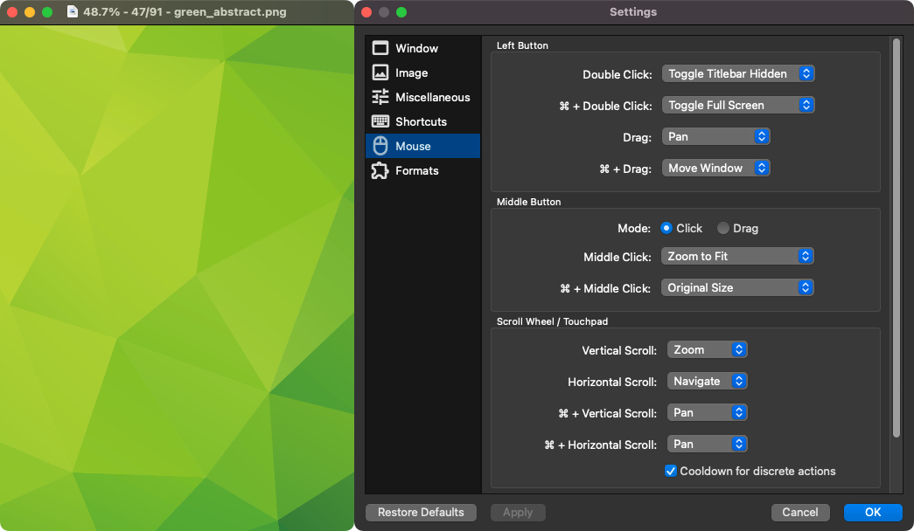

# qView
## Additional features in this fork
* Option to constrain image position to keep it snapped inside the viewport.
* macOS: Option to persist session across app restarts.
* Shows zoom level in titlebar in Practical/Verbose mode.
* Custom titlebar mode based on format string.
* Option to make zoom level relative to screen pixels (for Windows/Linux users with DPI scaling enabled; not so useful in macOS due to the way it handles scaling).
* Option to disable smooth scaling above a specified zoom level.
* Menu toggle to preserve zoom level when changing between images.
* "Fill Window" zoom option.
* Ability to hide the titlebar (via menu item, keyboard, or mouse shortcut).
* Ability to drag window via its viewport (Ctrl/Cmd + drag by default; customizable).
* Random file navigation (Go -> Random File, or "r" keyboard shortcut) to browse randomly without changing sort mode.
* Navigate between images when scrolling sideways (e.g. two finger swipe), or optionally, when clicking the left/right sides of the viewport.
* Customizable mouse actions (e.g. change what double clicking or middle clicking does).
* Option to ignore certain file extensions when navigating through a folder.
* Ability to keep window on top (via menu item + keyboard shortcut, and option to toggle on automatically during slideshow).
* Improved performance during rapid image navigation when holding down the previous/next file shortcut keys, and configurable speed no longer linked to key repeat rate.
* Windows: Supports dark mode even on Windows 10.
* macOS: Option to reuse existing window when launching with image.
* Configurable window positioning behavior after matching image size.
* More accurate zoom-to-fit plus customizable overscan setting.
* Option to hide mouse cursor in fullscreen mode.
* Option for checkerboard background.
* Option to disable icons in "Open Recent" and "Open With" submenus.
## Screenshot

## Supported platforms
* Windows 10+ (x64 or ARM64 binaries). You may need to install the [Visual C++ runtime](https://aka.ms/vs/17/release/vc_redist.x64.exe) if you don't have it already.
* macOS 12+ (Universal binary).
* Legacy Windows (7+, x86), Legacy macOS (10.13+, x64), and Linux AppImage binaries are built via GitHub Actions, but not well tested nor published as releases.
## About releases
There's nothing particularly special about the builds uploaded under "Releases". Every once in a while, typically after enough noteworthy changes, I simply download the binaries from a GitHub Actions run and upload them as a "Release". I do this to make them more easily accessible since the Actions artifacts are only available to users logged into GitHub, and to preserve them since the Actions artifacts expire after 90 days. But in general, I avoid committing unfinished/untested work to the `master` branch. So if you see a commit you're interested in there, no need to wait for a release; simply download the artifact from Actions.
